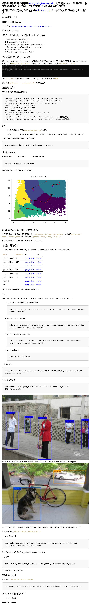
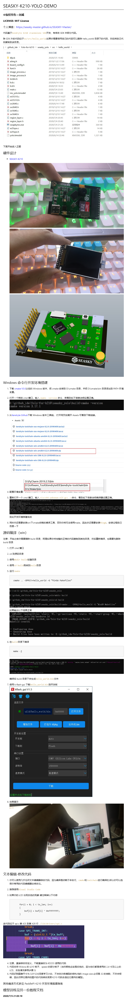

### **@版权所有->SEASKY**

### **LICENSE:** **MIT License**

### 个人博客：<a href="https://seasky-master.github.io/SEASKY-Master/">https://seasky-master.github.io/SEASKY-Master/</a>

以下内容为图片，具体完整的可复制内容见

- 模型训练.pdf
  - 训练模型并导出kmodel
- 模型部署到K210.pdf
  - kmodel在k210实现部署
  

