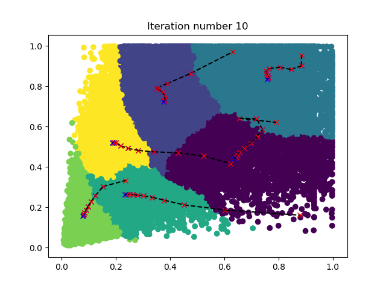

# Yolo-for-k210

## 环境配置

- windows
- python3.7
- tensorflow-gpu1.15
- cuda10.0
- cudnn7.4.2
- 其它扩展你可以使用 `pip3.7 install -r requirements.txt` 命令添加

## 准备数据集


- 推荐使用vott工具对数据集进行标注，导出为PascalVoc格式。

## 数据集处理

数据集须存放在/train-image/images
[数据集结构](/train-image/readme.md)

按照7:2:1的比例，生成训练集、验证集、测试集文件(pscalvoc.txt、train.txt、val.txt、test.txt)

```python
python datamaking.py 
```

```python
python datamakingv2.py 
```

然后使用python生成需要的文件

datamaking.py

    仅根据Annotations和JPEGImages目录
    生成
    同时会删除多余或不配对的 .xml .jpg 运行时间较长
    数据按7：2：1分配
datamakingv2.py

    仅根据Annotations目录下文件的.xml文件生成需要的pscalvoc.txt、train.txt、val.txt、test.txt
    运行时间较短，适用于确认数据集一一对应的情况

生成label

    python voc_label.py
    cat  MyImage_train.txt MyImage_val.txt> train.txt   Linux使用此命令
    type MyImage_train.txt MyImage_val.txt> train.txt	  windowns使用此命令

注意：

- 改变路径后重新训练需从`python voc_label.py`从新开始

- win 不支持 wget，因此你需要安装相关工具，或直接在浏览器中输入 wget 后面的网址，下载后复制到改目录

然后将 IMG 路径和注释合并到一个 NPY 文件

    python make_voc_list.py train.txt data/voc_img_ann.npy

## 生成 anchors

加载注释生成 anchors(LOW 和 HIGH 视数据集的分布而定)：

    make anchors DATASET=voc ANCNUM=3 LOW="0.0 0.0" HIGH="1.0 1.0"

当你成功的时候，你会看到这样以下内容：


注：结果是随机的。当你有错误时，就重新运行它。

如果要使用自定义数据集，只需编写脚本并生成`data/{dataset_name}_img_ann.npy`，然后使用`make anchors DATASET=dataset_name`。更多选项请参见`python3 ./make_anchor_list.py -h`

如果要更改输出层的数目，则应修改 OUTSIZE 在 Makefile

## 下载预训练模型

你必须下载您想要训练的模型权重，因为默认情况下会加载训练前的权重。把文件放进./data 目录。

| `MODEL`       | `DEPTHMUL` | Url                                                                                | Url                                        |
| ------------- | ---------- | ---------------------------------------------------------------------------------- | ------------------------------------------ |
| yolo_mobilev1 | 0.5        | [google drive](https://drive.google.com/open?id=1SmuqIU1uCLRgaePve9HgCj-SvXJB7U-I) | [weiyun](https://share.weiyun.com/59nnvtW) |
| yolo_mobilev1 | 0.75       | [google drive](https://drive.google.com/open?id=1BlH6va_plAEUnWBER6vij_Q_Gp8TFFaP) | [weiyun](https://share.weiyun.com/5FgNE0b) |
| yolo_mobilev1 | 1.0        | [google drive](https://drive.google.com/open?id=1vIuylSVshJ47aJV3gmoYyqxQ5Rz9FAkA) | [weiyun](https://share.weiyun.com/516LqR7) |
| yolo_mobilev2 | 0.5        | [google drive](https://drive.google.com/open?id=1qjpexl4dZLMtd0dX3QtoIHxXtidj993N) | [weiyun](https://share.weiyun.com/5BwaRTu) |
| yolo_mobilev2 | 0.75       | [google drive](https://drive.google.com/open?id=1qSM5iQDicscSg0MYfZfiIEFGkc3Xtlt1) | [weiyun](https://share.weiyun.com/5RRMwob) |
| yolo_mobilev2 | 1.0        | [google drive](https://drive.google.com/open?id=1Qms1BMVtT8DcXvBUFBTgTBtVxQc9r4BQ) | [weiyun](https://share.weiyun.com/5dUelqn) |
| tiny_yolo     |            | [google drive](https://drive.google.com/open?id=1M1ZUAFJ93WzDaHOtaa8MX015HdoE85LM) | [weiyun](https://share.weiyun.com/5413QWx) |
| yolo          |            | [google drive](https://drive.google.com/open?id=17eGV6DCaFQhVoxOuTUiwi7-v22DAwbXf) | [weiyun](https://share.weiyun.com/55g6zHl) |

注：mobilev 不是原创的，原作者有修改它适合 K210

## Train

使用 Mobileenet 时，需要指定 DEPTHMUL 参数。 使用 tiny yolo 或 yolo 你不需要设定 DEPTHMUL.

1.  集MODEL和DEPTHMUL开始训练：
        make train MODEL=yolo_mobilev1 DEPTHMUL=0.75 MAXEP=10 ILR=0.001 DATASET=voc CLSNUM=20 IAA=False BATCH=8

2.  集CKPT继续训练:

        make train MODEL=yolo_mobilev1 DEPTHMUL=0.75 MAXEP=10 ILR=0.001 DATASET=voc CLSNUM=20 IAA=False BATCH=8 CKPT=log/xxxxxxxxx/yolo_model.h5

3.  集IAA为了增加数据:

        make train MODEL=xxxx DEPTHMUL=xx MAXEP=10 ILR=0.0001 DATASET=voc CLSNUM=20 IAA=True BATCH=16 CKPT=log/xxxxxxxxx/yolo_model.h5

4.  使用 tensorboard:

        tensorboard --logdir log

## 推论

    make inference MODEL=yolo_mobilev1 DEPTHMUL=0.75 CLSNUM=20 CKPT=log/xxxxxx/yolo_model.h5 IMG=data/people.jpg

你可以尝试我的模型：

    make inference MODEL=yolo_mobilev1 DEPTHMUL=0.75 CKPT=asset/yolo_model.h5 IMG=data/people.jpg


	make inference MODEL=yolo_mobilev1 DEPTHMUL=0.75 CKPT=asset/yolo_model.h5 IMG=data/dog.jpg


注：由于 anchors 是随机生成的，如果您的结果与上面的图像不同，你只需要加载这个模型并继续训练一段时间。

更多选项请参见`python3 ./keras_inference.py -h`

## 修剪模型

    make train MODEL=xxxx MAXEP=1 ILR=0.0003 DATASET=voc CLSNUM=20 BATCH=16 PRUNE=True CKPT=log/xxxxxx/yolo_model.h5 END_EPOCH=1

训练结束时，将模型保存为 log/xxxxxx/yolo_prune_model.h5.

## Freeze

    toco --output_file mobile_yolo.tflite --keras_model_file log/xxxxxx/yolo_model.h5

现在你有了 mobile_yolo.tflite

## 转换 Kmodel

Please refer <a href="https://github.com/kendryte/nncase/tree/v0.1.0-rc5">`nncase v0.1.0-RC5 example`</a>

    ncc mobile_yolo.tflite mobile_yolo.kmodel -i tflite -o k210model --dataset nncase_images

## 将 Kmodel 部署到 K210

- 见另一个文档

**2020/7/5 21:04:35**
